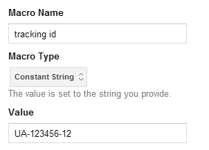
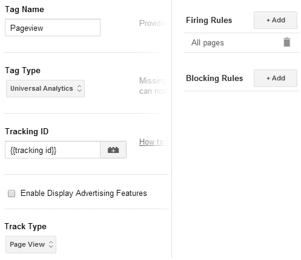

Google Tag Manager (GTM) is still pretty new as I write this. Stuff is still changing so I'm going to try to focus on techniques rather than step by step instructions (but I have some of those too).

<h3>What is GTM</h3>

You include a code snippet from GTM on your site which, among other things, includes a file. Then you use the GTM interface to configure what goes in that file.

This is intended to replace any scripts you'd normally have to write yourself to track stuff that isn't a regular page view (example: tracking a file download as a page view). Say good bye to code like this: <code>pageTracker._trackPageview(fileurl);</code>

<h3>Why do we care?</h3>

One snippet to rule them all. All your tracking scripts and pixels can be moved off the page and into GTM. Smaller pages, faster loading! They have some already supported services (AdWords, DoubleClick, Remarketing, Mediaplex...) and you can theoretically code support for others in yourself.

Theoretically, it means non-technical people will be able to do the set up for this kind of tracking. Less work for us! But let's face it, the interface was written by devs, it still needs some technical knowledge.

It cuts down on the amount of code writing and maintenance we have to do in the future. Also less work for us!

<h3>Is it a trap?</h3>

Could be. Yup.

A javascript error in GTM code can break all the javascript on the page and anyone with access to your GTM account can add javascript.

GTM seems to insist on following the href on &lt;a&gt; elements. So if you are hijaxing any links GMT could break your code. For example: if you are using a lightbox style plugin which opens links in overlays.

Some GTM features can add query strings or hash tags to URLs, depending on the system on the other end of the link, this could cause problems too.

So test, and limit the publishing permissions on your account to people who know how to test.

<h3>Creating an account</h3>

Remember how we all went out and got personal Google Analytics accounts and added our clients to them and then stopped working for those clients and it got awkward? Google remembers too.

You hook an existing personal login up to GTM and then have the option to create accounts. One per business is ideal here. Then you get to set up what Google is calling a container. A container contains all the code snippets you are going to want to run. Google suggests you should create a different container for each website associated with the business that owns the account.

(This seems like sound advice if you're just getting started but will lead to some code duplication in the long run if you have multiple domains, I have complicated thoughts on this that belong in a separate blog post).

Once you've set up a container you get the code snippet. Place the code snippet on the page after the opening &lt;body&gt; tag.

<h3>What's all this?</h3>

Your container contains 3 things: tags, rules, and macros.

<strong>Tags</strong>
Tags are individual things to do. Things like "listen for links being clicked on", "track this page view", "listen for form submissions", "track this conversion",  "track pressing play". They're individual tasks so listening for form submissions and tracking a conversion takes two separate tags.

<strong>Rules</strong>
Rules are when to apply tags. The basic one is "on every page". Each rule can have multiple conditions so you can combine them to create rules like "if this event is a click and it happened on an element that does not link to this website".

<strong>Macros</strong>
Macros are just a way to store stuff you're likely to re-use (mostly text or javascript). There's some pre-populated ones and you can write your own. Stuff I've been keeping in macros: our analytics tracking number, a line of javascript that retrieves the page title, and a complex regex that checks if the href of a link takes the user off the current site. You reference macros inside tags, rules, and other macros by writing its name in  {{double curly braces}}.

<h3>Example: Tracking page views and external link clicks with Universal Analytics</h3>

My examples are all for Universal Analytics but if you're still using Classic the concept is the same where I pick Universal Analytics from the Tag Type menu pick Google Analytics Classic and do your best with the slightly different options that follow from there.

This is, more or less, what we'll be setting up, in an order that makes sense to me:

<ol>
    <li><em>Macro</em>: your Analytics tracking number.</li>
    <li><em>Tag</em>: track a pageview in Analytics.</li>
    <li><em>Tag</em>: listen for clicked links.</li>
    <li><em>Rule</em>: if link does not lead to current site.</li>
    <li><em>Tag</em>: create event in Analytics for outbound link click.</li>
    <li>Create version</li>
    <li>Preview</li>
    <li>Publish</li>
</ol>

I found the actual order somewhat more headache inducing, and that's why I'm writing a blog post about it. Hopefully you end up at the end of this list with link tracking and no headache.

Once you've followed these steps once hopefully you will understand how the pieces fit together and you can go on to work in the way that makes the most sense to you :)

This is the part where I list actual steps, this part might change as the product develops.

<ol>
    <li><em>Macro</em>: your Analytics tracking number.
        <ol>
            <li>In Analytics get your tracking ID from Admin > Property Settings</li>
            <li>In GTM go to your container's overview page.</li>
            <li>Click the big red "new" button and pick "macro" out of the list.</li>
            <li> Configure the macro like this:
                <dl>
                    <dt>Macro Name:</dt>
                    <dd><kbd>tracking ID</kbd> (well you can name it whatever you want)</dd>
                    <dt>Macro Type:</dt>
                    <dd><kbd>Constant String</kbd></dd>
                    <dt>Value:</dt>
                    <dd><em>Your tracking ID</em></dd>
                </dl>
                Or, if prefer a screen shot:
                
            </li>
            <li>Save it.</li>
        </ol>
    </li>
    <li><em>Tag</em>: track a pageview in Analytics.
        <ol>
            <li>Click the big red "new" button and pick "tag" out of the list.</li>
            <li> Configure the macro like this:
                <dl>
                    <dt>Tag Name:</dt><dd><kbd>Pageview</kbd></dd>
                    <dt>Tag Type:</dt><dd><kbd>Google Analytics</kbd> & gt; <kbd>Universal Analytics</kbd></dd>
                    <dt>Tracking ID:</dt><dd><kbd>{{tracking ID}}</kbd>  This is the macro we just created. You can either type it yourself or click the little lego block to pick it out of a list.</dd>
                    <dt>Track Type:</dt><dd><kbd>Page View</kbd></dd>
                    <dt>Firing Rules:</dt><dd>Add <kbd>All pages</kbd>  You don't have to create this rule, GTM creates it automatically.</dd>
                </dl>
                Or, if you prefer a screen shot:
                
            </li>
            <li>Save it.</li>
        </ol>
    <li><em>Tag</em>: listen for clicked links.
        <ol>
            <li>Click the big red "new" button and pick "tag" out of the list.</li>
            <li> Configure the macro like this:
                <dl>
                    <dt>Tag Name:</dt><dd><kbd>Listener - linkClick</kbd></dd>
                    <dt>Tag Type:</dt><dd><kbd>Link Click Listener</kbd></dd>
                    <dt>Firing Rules:</dt><dd>Add <kbd>All pages</kbd> </dd>
                </dl>
                Leave everything else on the defaults.</li>
            <li>Save it.</li>
        </ol>
    </li>
    <li><em>Rule</em>: if link does not lead to current site.
        <ul>
            <li>Click on the big red "new" button and pick "rule" out of the list.</li>
            <li>Configure the rule like this:
                <dl>
                    <dt>Rule Name:</dt><dd><kbd>on - outbound link click</kbd></dd>
                    <dt>Conditions:</dt><dd><kbd>{{event}} equals gtm.linkClick</kbd></dd><dd><kbd>{{element url}} starts with </kbd><em> your site URL</em> </dd>
                </dl>
            </li>
            <li>Save it.</li>
        </ul>
        I actually use a complex regex in a macro for the conditions to catch a few edge cases like: urls missing the www, relative links, mailto/tel/ftp etc. but for this example and basic sites this will get what we want.
    </li>
    <li><em>Tag</em>: create event in Analytics for outbound link click.
        <ul>
            <li>Click on the big red "new" button and pick "tag" out of the list.</li>
            <li>Configure the rule like this:
                <dl>
                    <dt>Tag Name:</dt><dd><kbd>UA event - outbound link</kbd></dd>
                    <dt>Tag Type:</dt><dd><kbd>Universal Analytics</kbd></dd>
                    <dt>Tracking ID:</dt><dd><kbd>{{tracking id}}</kbd></dd>
                    <dt>Track Type:</dt><dd><kbd>Event</kbd></dd>
                    <dt>Category:</dt><dd><kbd>outbound-link</kbd></dd>
                    <dt>Action:</dt><dd><kbd>{{element url}}</kbd></dd>
                    <dt>Label:</dt><dd><kbd>{{element text}}</kbd></dd>
                    <dt>Value:</dt><dd><kbd>1</kbd></dd>
                </dl>
            </li>
            <li>Save it.</li>
        </ul>
        If you have an existing implementation you are trying to match so your stats aren't disrupted you should look in Google Analytics to see what you are currently using for the event category, action and label and match those values instead :)
    </li>
    <li>Create version
        <ul>
            <li>On the Container Draft > Overview page the Create Version button is in the top right.</li>
            <li>If you really want to be on the ball you can amend the name or add notes to describe what you added in this version, handy in case you want to roll back.</li>
        </ul>
    </li>
    <li>Preview
        <ul>
            <li>The Preview button is also on the top right of the Container Draft > Overview screen.</li>
            <li>Click Debug in the popover</li>
            <li>In the next popover click on the url of your site. This will open a new window with your site and a Tag Manager window at the bottom.</li>
            <li>In the window at the bottom check that:
                <ul>
                    <li>"Page View - Page" and "Listener - linkClick" have the status "Fired on Tag Manager Load"</li>
                    <li>Click on a link and check that "UA event - outbound link" gets added with the status "Fired on Event "gtm.linkClick". You can usually see it flash to the top before the other page loads but if it's too fast find (or create) a link with the attribute target="_blank" to click.</li>
                </ul>
            </li>
            <li>If something is not working check your rules and try again.</li>
            <li><strong>Also important,</strong> check that the javascript on your own pages is working properly. In an ideal world you have a list of features you can test.</li>
            <li>Exit preview mode</li>
        </ul>
    <li>Publish (blue button in top right of Container Draft > Overview page)</li>
</ol>

You can see some changes applied immediately in Analytics on the Real-Time > Overview page. Other events which don't seem to be working on Real-Time occasionally start showing up in the stats a day later. I have no insight to offer here, sorry.

<h3>Summary</h3>

So we create tags to do things, rules to govern when we do the things in the tags, and macros to save ourselves time when creating tags and rules.

